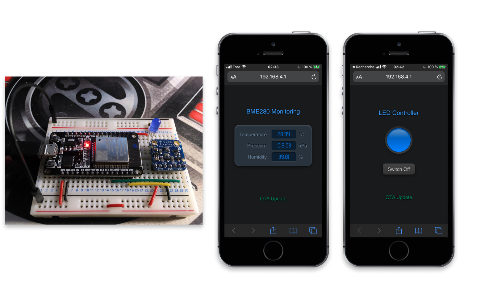
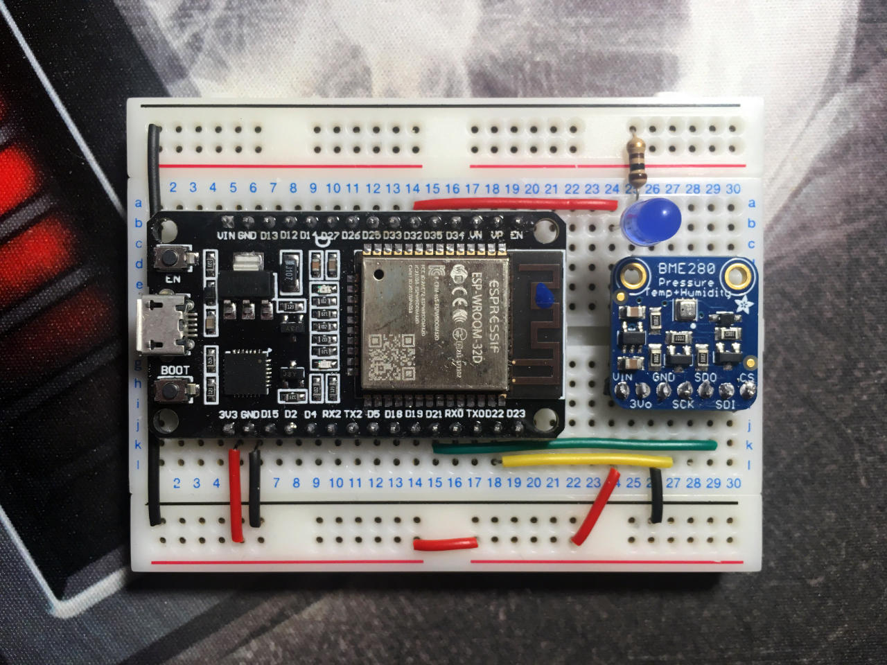

# ESP32 Web Apps with WebSockets & OTA Web Updates

This project came out of a [discussion][topic] I had with David H. on the [Random Nerd Tutorial Lab forum][rntlab] about the possibility of updating the firmware of an ESP32 through a WiFi connection. That is, without having to be connected to the microcontroller by a USB cable.

To illustrate the process, this project includes two completely independent applications that can be uploaded and run in turn to the ESP32. Each of these applications implements a web server to expose a user interface to interact with the ESP32 from a browser on a mobile phone or a computer.

I have chosen here to propose two applications that are relatively simple to implement so as not to add complexity to the central issue at hand:

- The first application allows a simple LED to be switched on or off.
- The second one allows to display the measurements of an environmental sensor.



For the demonstration, I used the [DoIt ESP32 DevKit v1][devkit] development board (Rui & Sara's favorite board).

I used a blue LED that can be found in all Arduino starter kits. Its forward voltage, measured with a multimeter, is 2.61V. So I added a resistor of 100Ω in series so as not to burn it out.

The environmental sensor is a BME280. Rui & Sara recommend using [this one][bme280] in their tutorials. But I didn't have one on hand. So I used what I had: the [Adafruit's version][bmeada] which has the unfortunate tendency to heat up slightly when powered, because of its built-in voltage regulator. The observed temperature difference can go up to +2°C (yes I know, it's annoying...).


## Preliminary Readings

To fully understand what we're doing here, I suggest you take a look at the following articles on [Random Nerd Tutorials][rnt]:

- [ESP32 Web Server with BME280 – Advanced Weather Station][rnt-bme280]
- [ESP32 Web Server using SPIFFS (SPI Flash File System)][rnt-spiffs]
- [ESP32 Over-the-air (OTA) Programming – Web Updater Arduino IDE][rnt-ota]

Regarding the communication between the web browser and the ESP32, I have nevertheless taken a different approach to optimize data exchange during the phase of reading the measurements or taking control of the LED. I have indeed preferred to use WebSockets, which are much more efficient than a simple web server.


## Prototype wiring

The BME280 sensor is connected to the ESP32 I2C bus.  
Here are the control pins I used:

- **D21** (I2C SDA) is connected to the SDI pin of the BME280 (data line)
- **D22** (I2C SCL) is connected to the SCK pin of the BME280 (clock line)
- **D32** is connected to the LED



The BME280 sensor is powered by the ESP32 with 3.3V on its `Vin` input.


## Structure of the project

The main sketch `ota-web-updates.ino` will allow you to compile any of the applications.  
Just uncomment the line corresponding to the application you want to compile.

```cpp
// #include "src/bme280.h"
// #include "src/led.h"
```

The application sources are located in the `src` directory:

```
src
├── bme280.h
├── led.h
└── secret.h
```

`secret.h` contains the WiFi network credentials that you will want to set:

```cpp
const char * SSID     = "MY_SSID";
const char * PASSWORD = "MY_PASSWORD";
```

The ESP32 will be able to broadcast its own WiFi network (in access point mode) or you will be able to connect it to your ambient WiFi network, in station mode.

The user interfaces of each web application will need to be hosted on the ESP32's SPIFFS file system. You will find the HTML / CSS / JavaScript source codes for these interfaces in the `data` folder:

```
data
├── bme280
│   ├── index.css
│   ├── index.html
│   ├── index.js
│   └── seven-segment.ttf
└── led
    ├── index.css
    ├── index.html
    └── index.js
```


## How web applications work

I deliberately avoided an object-oriented design to implement these applications in order not to add complexity to the understanding of the central topics that are illustrated here.

Each application runs:

- a Web server for distributing the user interface HTML / CSS / JavaScript files to the client browser of a mobile phone or a computer. The following libraries are used for this:
  - [AsyncTCP][asynctcp]
  - [ESPAsyncWebServer][espasyncws]

- a WebSockets server to handle interactions between the user and the ESP32. In one case, the user will be able to turn the LED on or off by simply pressing a button on the web page displayed in his browser. In the other case, the ESP32 will periodically relay the temperature, pressure and humidity readings from the BME280 sensor to the browser. The following library is used here for this purpose:
  - [arduinoWebSockets][websockets]


## Over-The-Air (OTA) web updater

Finally, here is the main point we are interested in this project: you will also have the possibility to upload the application of your choice to the ESP32 in turn by updating its firmware through the web server. We have used the [AsyncElegantOTA][elegantota] library here to simplify this task.


## Demo

Click on the image below to watch the video:

[![Demo][thumbnail]][video]


## Acknowledgements

- Thanks to [Rui & Sara][rnt] for sharing their passion through their tutorials.
- Thanks to [Krafti Lab][kraftilab] Studio for its [Seven Segment][dafont] True Type Font.


[topic]:      https://rntlab.com/question/using-webserver-and-ota-updates/
[rntlab]:     https://rntlab.com/forum/
[devkit]:     https://makeradvisor.com/tools/esp32-dev-board-wi-fi-bluetooth/
[bme280]:     https://makeradvisor.com/tools/bme280-sensor-module/
[bmeada]:     https://www.adafruit.com/product/2652
[rnt]:        https://randomnerdtutorials.com/
[rnt-bme280]: https://randomnerdtutorials.com/esp32-web-server-with-bme280-mini-weather-station/
[rnt-ota]:    https://randomnerdtutorials.com/esp32-over-the-air-ota-programming/
[rnt-spiffs]: https://randomnerdtutorials.com/esp32-web-server-spiffs-spi-flash-file-system/
[asynctcp]:   https://github.com/me-no-dev/AsyncTCP
[espasyncws]: https://github.com/me-no-dev/ESPAsyncWebServer
[websockets]: https://github.com/Links2004/arduinoWebSockets
[elegantota]: https://github.com/ayushsharma82/AsyncElegantOTA
[thumbnail]:  assets/youtube-641x479.jpg
[video]:      https://www.youtube.com/watch?v=c-aPWPvj67U
[kraftilab]:  http://www.kraftilab.com/
[dafont]:     https://www.dafont.com/seven-segment.font